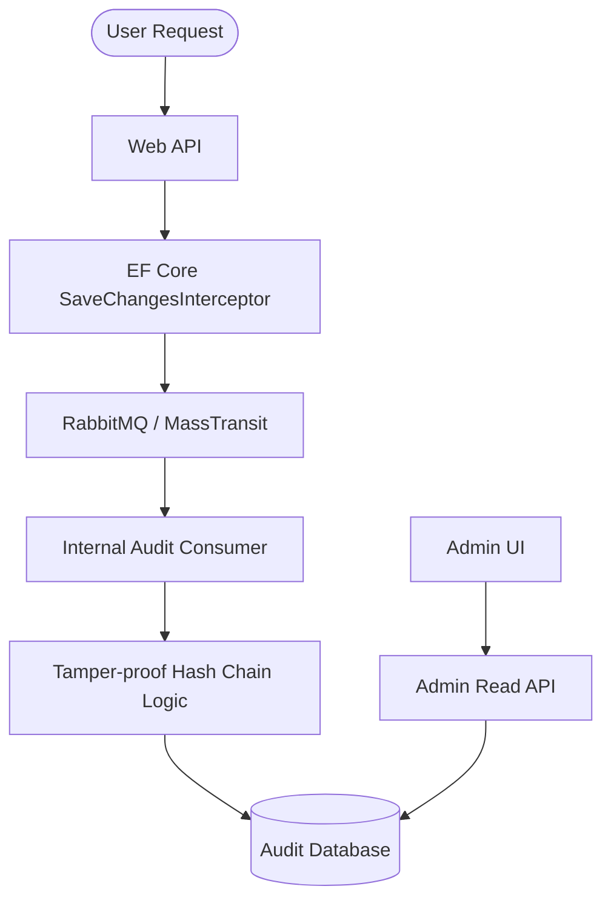

# Enterprise Audit Platform Architecture

## Overview
The Audit Platform is designed to be fully automated, event-driven, and tamper-proof. It decouples audit log generation from persistence to ensure minimal impact on application performance.

## Data Flow

## Design Decisions

### 1. Unified Infrastructure Layer
The audit logic is consolidated within the `Infrastructure` layer. The background processing (consumption of audit events and periodic cleanup) runs as part of the main application process. This simplifies deployment while maintaining the asynchronous benefits of the message bus.

### 2. Internal Background Services
Instead of a separate worker service, a MassTransit Consumer and a `BackgroundService` are registered within the `Infrastructure` project. This ensures that the audit logs are processed independently of the HTTP request thread.

### 3. Cryptographic Hash Chaining
Every audit log entry contains a `Hash` and a `PreviousHash`.
- `Hash = HMAC-SHA256(RecordData + PreviousHash)`
- This creates an immutable chain that makes it impossible to delete or modify a record without breaking the entire chain's integrity.

### 4. Correlation & Distributed Tracing
Each audit log captures a `CorrelationId`. Using OpenTelemetry, these IDs are propagated across the message bus, allowing a single user request to be traced from the API through to the Audit Worker.

### 5. Sensitive Data Masking
The `[AuditIgnore]` attribute allows developers to mark properties (like passwords or credit card numbers) that should never be stored in the audit trail. These are replaced with `[MASKED]` during serialization.

## Infrastructure
- **Message Broker:** RabbitMQ
- **Audit Storage:** PostgreSQL (Dedicated Instance)
- **Tracing:** OpenTelemetry + Jaeger
- **Cleanup:** Automatic 90-day retention via BackgroundService
